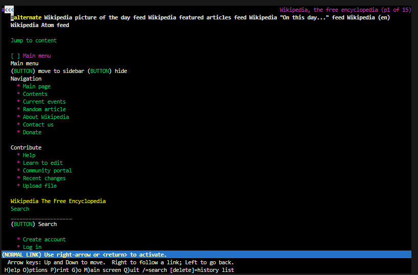

# Docker-Lynx

Browse the web using Lynx - a text-based web browser. Lynx was first released 1992.

[Lynx web browser (Wikipedia)](https://en.wikipedia.org/wiki/Lynx_(web_browser))

[Maintained software: lynx.invisible-island.net](https://lynx.invisible-island.net/)

---

Lynx displaying wikipedia.org

---

## Steps

### 1 Download and install Docker

This repo depends on software containerization using [Docker](https://www.docker.com/)

### 2 Open a terminal and run command

(Docker image using a slim Debian version. Lynx version installed 2.8.9 - march 2024. In order to avoid *modern ssl* protocol prompts in Lynx, a setting in lynx.cfg is set to *FORCE_SSL_PROMPT:YES*)

Command to build application:

`docker build . -t lynx`

Command to run application:

`docker run -it --rm --name lynx lynx`

Run both commands to build and run application (separated with semicolon):

`docker build . -t lynx ; docker run -it --rm --name lynx lynx`

### 3 Browse 

Terminal displays a bash prompt. Go to a website using lynx:

`lynx wikipedia.org`